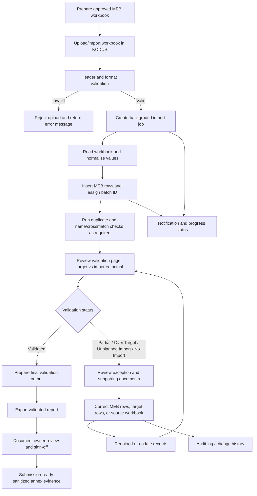

# Annex B - MEB Validation Workflow

**Document status:** Draft for validation by the KODUS document owner  
**System:** KliMalasakit Operational Data Unified System (KODUS)  
**Workflow covered:** Upload/import, preprocessing, duplicate and crossmatch checks, MEB validation review, correction/reupload, final validated output, and notifications/background job behavior  
**Privacy note:** This annex describes workflow controls and sample structures only. It does not include production beneficiary records.

## B.1 Purpose

This annex documents the current KODUS-supported process for receiving, importing, validating, correcting, and reporting the Master List of Eligible Beneficiaries (MEB). The workflow supports DSWD/KM documentation, internal monitoring, and data-quality review by linking uploaded MEB records with fiscal-year implementation targets and related validation utilities.

## B.2 System Modules Used

| Workflow area | KODUS module / route | Documentation note |
| --- | --- | --- |
| MEB import and listing | `pages/data-tracking-meb.php`, `pages/import.php`, `pages/meb_import_helpers.php`, `pages/meb_import_worker.php` | Imports Excel workbooks into the `meb` table and assigns batch numbers. |
| MEB validation | `pages/data-tracking-meb-validation.php`, `pages/fetch_data_validation_admin.php`, `pages/update_validation_status.php` | Compares imported MEB actual counts with target partner-beneficiary counts. |
| Baseline targets | `implementation-status/program-targets.php`, `implementation-status/save-project-target.php`, `implementation-status/import-project-targets.php` | Provides target counts used for validation comparison. |
| MEBIS consolidation | `mebis-consolidator/` | Supports consolidation of MEBIS workbooks and output history. |
| MEBIS LGU import template | `mebis-lgu-template/` | Converts final validated workbooks into import-ready templates and supports background processing. |
| Deduplication | `deduplication/` | Detects possible duplicates within uploaded beneficiary datasets. |
| Crossmatch | `crossmatch/` | Scores uploaded records against candidate records or MEB records. |
| Notifications/live refresh | `app_notification_helpers.php`, `dist/js/kodus-live-refresh.js`, `socket_helpers.php` | Notifies requesting users and refreshes affected tables when supported. |
| Audit records | `audit_helpers.php`, `meb_change_history_helpers.php`, `admin/audit_logs.php` | Records state-changing requests and explicit validation updates. |

## B.3 End-to-End Workflow

### Step 1. Prepare and Upload Source Workbook

Authorized personnel prepare the MEB workbook using the expected column structure. The current import helper expects fields covering name components, location, birthdate, age, sex, civil status, NHTS-PR/LSWDO indicators, 4Ps indicator, and sectoral/disability classifications.

**Control notes:**

- Only approved Excel formats are accepted for MEB import.
- Workbooks must be reviewed before upload to avoid loading personal data outside authorized purpose.
- Upload files and generated outputs are treated as sensitive operational data.

Approved MEB workbooks should originate from the authorized program/data owner for the applicable reporting period. Before upload, the accountable uploader confirms that the workbook follows the approved template, contains only records covered by the authorized purpose, and has been cleared by the responsible program focal or data owner.

### Step 2. Preprocessing and Header Validation

KODUS checks the uploaded workbook for expected headers and rejects mismatched column structures. Birthdates are normalized where possible. The 4Ps field is normalized to recognized code values where applicable.

**Expected MEB import categories include:** name, purok/barangay/LGU/province, birthdate, age, sex, civil status, NHTS-PR, LSWDO assessment, 4Ps, farmers, fisher-folks, informal sector, Indigenous People, senior citizen, solo parent, lactating women, pregnant women, persons with disability, out-of-school youth, former rebel, YAKAP Bayan/person who used drugs, and LGBTQIA+.

### Step 3. Background Import Job

For background import, KODUS creates an import job with status, progress, current step, source filename, requested user, row count, and timestamps. The worker processes the file, inserts valid rows into the `meb` table, assigns a batch ID, and removes the temporary source file after processing.

**Observed job states:** queued, processing, completed, failed.  
**Observed progress messages:** queued, reading workbook, saving records, completed, failed.

### Step 4. Duplicate Checks

The deduplication utility supports duplicate detection using required fields: last name, first name, middle name, extension, birthdate, barangay, LGU/municipality, and province. Results are grouped by duplicate group and include similarity percentages.

**Control notes:**

- Possible duplicate records must be reviewed by authorized personnel before any correction or exclusion.
- Duplicate findings are decision-support outputs and should not be treated as automatic deletion instructions.

Operational duplicate thresholds should follow the configured KODUS deduplication job settings for the reviewed run. Potential duplicates are routed for reviewer validation; final correction, exclusion, or retention decisions remain subject to the approved program/data-owner SOP and supporting source documents.

### Step 5. 4Ps / NHTS-PR / Crossmatch Checks

KODUS imports and stores indicators for NHTS-PR/Listahanan 3, LSWDO assessment, and 4Ps. Crossmatch utilities can compare uploaded records with candidate records using weighted name, birthdate, and address scoring.

**Control notes:**

- External 4Ps or NHTS-PR confirmation must follow official DSWD validation protocol.
- Crossmatch scores require reviewer judgment, especially where spelling, suffix, birthdate, or address data are incomplete.

4Ps and NHTS-PR/Listahanan indicators should be confirmed only through authorized DSWD source systems or official validation records. Crossmatch outputs are used as decision-support evidence and should be documented through the approved validation memo or reviewer action record for the reporting period.

### Step 6. Validation Results Review

The MEB validation screen compares location-level target partner-beneficiaries against imported actual beneficiaries for the selected fiscal year.

| Validation status | System interpretation |
| --- | --- |
| No Target | No target count is encoded for the location and no imported actual is present. |
| No Import | Target exists, but no imported MEB rows are present. |
| Partial | Imported actual is less than target. |
| Validated | Imported actual equals target. |
| Over Target | Imported actual exceeds target. |
| Unplanned Import | Imported actual exists for a location with no encoded target. |

### Step 7. Correction and Reupload

Where the validation screen identifies Partial, Over Target, Unplanned Import, or other exceptions, authorized users review affected rows and correct source data or target data as applicable. KODUS supports editing MEB rows and returning to the validation screen.

**Control notes:**

- Corrections must be supported by approved source documents or official validation response.
- Changes to MEB rows should be reviewed through the change-history/audit mechanism.
- Reupload should be used only where correction by source workbook is the approved process.

### Step 8. Final Validated Output

Once counts and exception handling are complete, authorized users may export validation outputs. The current validation export produces an Excel report titled `MEB Validation Target vs Actual` with province, municipality, barangay, target partner-beneficiaries, imported partner-beneficiaries, variance, and validation status.

[MANUAL INPUT REQUIRED: Insert final validation sign-off protocol, approving official, and reporting period.]

### Step 9. Notification and Live Refresh Behavior

KODUS creates app notifications for MEB import success/failure and validation updates. It also broadcasts MEB change events to refresh affected tables where live refresh or the optional Socket.IO bridge is configured.

Relevant events include `meb.changed` and `meb.validation.changed` under the `kodus.meb` channel.

## B.4 Workflow Diagram Source

The following Mermaid diagram source may be rendered for inclusion in DOCX/PDF submissions.

## B.5 Roles and Responsibilities

| Role | Responsibility |
| --- | --- |
| System administrator | Manages users, access, maintenance settings, audit review, and system-level controls. |
| Authorized MEB uploader | Uploads approved MEB workbooks and monitors background import status. |
| MEB validator / reviewer | Reviews validation statuses, duplicate findings, crossmatch findings, and correction requirements. |
| Program focal / target owner | Confirms baseline target partner-beneficiaries and resolves target discrepancies. |
| Data protection / KM reviewer | Ensures documentation uses sanitized evidence and excludes personal data and secrets. |
| Approving official | Confirms final validation output and authorizes formal submission. |

For the controlled submission copy, these generic roles map to the officially assigned KODUS system administrator, authorized MEB uploader, MEB validator/reviewer, program focal or target owner, KM/GPD reviewer, data-protection reviewer, and approving official designated by DSWD Field Office Caraga.

## B.6 Validation Controls

| Control | Implementation or documentation basis |
| --- | --- |
| Role-based access | KODUS implements admin/editor/AA/user roles and area-aware editing helpers. |
| Fiscal-year context | MEB validation requires selected fiscal year. |
| Header validation | Import helper checks expected MEB columns before saving records. |
| Batch traceability | Imported MEB records receive batch IDs. |
| Target-versus-actual comparison | Validation screen compares `project_lawa_binhi_targets` against imported `meb` rows. |
| Exception status | Validation badges identify no target, no import, partial, validated, over target, and unplanned import. |
| Audit trail | Validation updates and state-changing requests are recorded in audit logs. |
| Notifications | Import and validation changes generate app notifications and live refresh events. |
| Export formatting | Excel exports use common styling helpers and include report titles/fiscal year. |

## B.7 Owner Validation Notes

- Duplicate, crossmatch, 4Ps, and NHTS-PR findings are handled through reviewer validation and official source-document confirmation before any correction or exclusion is applied.
- [MANUAL INPUT REQUIRED] Insert official reviewer, approver, date, and signatory block.
- [MANUAL INPUT REQUIRED] Attach screenshots from Annex A after sanitization.
- The reviewed KODUS validation screen provides location-level target-versus-actual matching; individual-level external list confirmation, when required, is treated as an owner-controlled validation activity outside the annex sample data.
